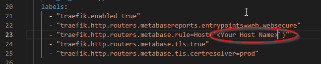
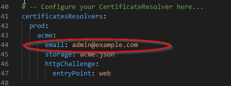

# Vicarius-vRx-Reports-Dashboard

Tested on Ubuntu Server 22.04 LTS

# VicariusVrxReports Setup Instructions

## Prerequisites 

### Virtual Machine 
A virtual machine is recommended to install the vRx Reports Dashboard. 

#### Sizing Recommendations 
Sizing recommendations are based on the number of assets in your dashboard. 
 * Less than 500 assets
   * 2 Core CPU - 4 GB Ram - 20 GB Disk
 * 500 to 1000 assets
   * 2 Core CPU - 8 GB Ram - 30 GB Disk
 * Over 1000 assets
   * 4 Core CPU - 12 GB Ram - 50 GB Disk    

#### OS Recommendations
  * Ubuntu 22.04 has been thoroughly tested
  * Any OS that supports Bash scripting and Docker


### Review the following KB article to create a new API Key from your Vrx Dashboard
https://customer-portal.vicarius.io/getting-started-with-vrx-rest-api

### Your dashboard_id corresponds to the url you use to login to your dashboard
Example: organization in https://organization.vicarius.cloud/

# Installation Method 
## Method 1: URL Download

### Download and unzip the file
Download the package to the asset that will host the docker containers
vRxReportsDashboard.tar.gz https://github.com/jordan-Vicarius/Vicarius-vRx-Reports-Dashboard/releases/latest/download/vicarius-vrx-reports.tar.gz

Newest Version
```bash
mkdir vicarius-vrx-reports-dashboard
cd vicarius-vrx-reports-dashboard
wget https://github.com/jordan-Vicarius/Vicarius-vRx-Reports-Dashboard/releases/latest/download/vicarius-vrx-reports.tar.gz
tar -xvzf vicarius-vrx-reports.tar.gz
```


### Install Docker and configure the containers
Install the Docker stack using the installDocker.sh script:

```bash
sudo chmod +x installDocker.sh
sudo ./installDocker.sh
```

### Initialize Docker Secrets 
Create docker secrets to stor your dashboard_id, api_key, postgres_user, postgres_password

```bash
sudo chmod +x initDocker.sh
sudo ./initDocker.sh
```
Copy your api key from the vRx dashboard 
- Login into your dashboard
- go to Settings - Integrations - Installed Integrations - API
- Click on the API and copy the API Key
- 


Your dashboard_ID is the first portion of your dashboard url 
- https://example.vicarius.cloud, Dashboard_id is example
- 

Create the password for the local Database. This user will be used to access the database by data visualization tools. Please keep the username and password in a safe place

Optional Tools:
Specify Which Optional Tools you would like to be installed. 
- Metabase: Data Visualization with Template
- 


### Bulid and push Docker images to Registry 
Deploy the Docker stack using the buildPushDocker.sh script:
```bash
sudo chmod +x buildPushDocker.sh
sudo ./buildPushDocker.sh
```

### Deploy Containers 
Deploy the Docker stack using the redeployDocker.sh script:
```bash
sudo chmod +x redeployDocker.sh
sudo ./redeployDocker.sh
```

* Running the redeployDocker.sh script will overwrite any existing application database. To update the docker image and keep the database intact use updateDocker.sh


# Confirm the Deployment

Run docker ps to confirm the containers are up.
```bash
sudo docker ps
```


# Optional Tools

## Metabase
https://www.metabase.com/
https://www.metabase.com/start/oss/
https://www.metabase.com/license/
Metabase is an open-source business intelligence platform licensed under AGPL. You can use Metabase to ask questions about your data, or embed Metabase in your app to let your customers explore their data on their own.

* It is recommended to let the app complete the initialization and first run before launching metabase. 
* The initial run can take several hours depending on the size of your data.
* A progress bar is planned 

Metabase will install with Traefik to facilitate SSL/TLS connections. 

### Install Metabase

Add a hostname to the metabase docker compose file
```bash
nano metabase/docker-compose.yml
``` 
Locate line 23 inside the labels section and add your hostname


Once complete line 23 should read something like this
```bash
- "traefik.http.routers.metabase.rule=Host(`metabase.example.com`)"
```
Add your email for a lets encrypt certificate
* you can skip this step if metabase will not be exposed to the public internet 
```bash
nano traefik/config/traefik.yaml
``` 
Locate line 44 inside the certificatesResolvers: section and replace admin@example.com with your email



To install Metabase run the optional-metabaseInstall.sh script.
```bash
sudo chmod +x optional-metabaseInstall.sh
sudo ./optional-metabaseInstall.sh
 ```
### Check that Metabase is running

Metabase Docker Service 
```bash
sudo docker service ls
 ```


*The containers can take 5 minutes to come online and be active 

### Configure Metabase
Navigate to Metabase installation in a web browser 
- > https://your_host

The Metabase installation installs a template by default. When you navigate to the your installation you will receive a login page. Please log in using the default credentials 
* The Login prompt can take some time to appear depending how much data needs to be pulled into the local database from vRx.


- Default Username: vrxadmin@vrxadmin.com
- Default Password: Vicarius123!@#

Once Logged in go to settings account settings and change the default password 
- 


After changing the default credentials, Change the database settings to reflect the database user and password created earlier.

- Go to Settings - Admin Settings - Selecte Database on the top navigation window
-
- Select the vRX-Reports database
- Change the following settings
  - Database Name: Your dashboard name
  - Username: Database user created earlier
  - Passowrd: Database password created earlier
- Save Changes

## Portainer CE
https://docs.portainer.io/start/install-ce
Portainer Community Edition (CE) is our foundation. With over half a million regular users, CE is a powerful, open source toolset that allows you to easily build and manage containers in Docker, Docker Swarm, Kubernetes and Azure ACI.

To install Portainer run the portainerInstall.sh script.
```bash
sudo chmod +x portainerInstall.sh
sudo ./portainerInstall.sh
 ```

---

**Additional Notes:**
- Ensure your Docker and Docker Compose versions support `version: '3.7'` as specified in `docker-compose.yml`.
- Adjust volume paths in `docker-compose.yml` as needed based on your directory structure.
- Verify that `entrypoint.sh` and `crontab` are correctly configured for your application.


# Updating the vRx Reports Dashboard
There are two types of upgrades to the vRx reports dashboard. 

## App update 
- Updates the app and appdb containers 

### Download and unzip the file
Make a new folder to extract to the tar file to
```bash
mkdir <folder_name>
cd <folder_name>
```

Download the package to the asset that will host the docker containers
vRxReportsDashboard.tar.gz https://github.com/jordan-Vicarius/Vicarius-vRx-Reports-Dashboard/releases/latest/download/vicarius-vrx-reports.tar.gz
```bash
wget https://github.com/jordan-Vicarius/Vicarius-vRx-Reports-Dashboard/releases/latest/download/vicarius-vrx-reports.tar.gz
tar -xvzf vicarius-vrx-reports.tar.gz
```

### Bulid and push Docker images to Registry 
Deploy the Docker stack using the buildPushDocker.sh script:
```bash
sudo chmod +x buildPushDocker.sh
sudo ./buildPushDocker.sh
```

### Update the containers
Update the Docker stack using the updateDocker.sh script:
```bash
sudo chmod +x updateDocker.sh
sudo ./updateDocker.sh
```
*Note, if you receive an error run the command again after a few seconds. 

This process will not deploy any optional containers. If you are running a web dashboard and want to update the web dashboard proceed to the next section. If you do not want to update the web dashboard, run the following command:
```bash
sudo chmod +x optional-metabaseInstall.sh
sudo ./optional-metabaseInstall.sh
 ```

## Reports Dashboard Template update
- Updates the Dashboard graphics
*Note: Any custom graphics will be erased and the login to the Reports Dashboard will be reset.

1. Make sure the report container is not running
```bash
sudo docker service rm vrx-reports-stack_metabase
 ```


2. Start the mgntDasboard 
```bash
sudo chmod +x optional-webapp.sh
sudo ./optional-webapp.sh
 ```
3. Navigate to HTTP://<your-host>:8000
*Note this should not be publicly accessible. Please make sure you have proper ACLs. 

4. Select the Update Report Template button 
- Wait for the page to load. This process can take several minutes

After the page loads, you should see the following output:
*Metabase Template is up to date*

This confirms the template updated. 


5. Stop the web management app.
 ```bash
sudo docker service rm vrx-reports-stack_web
 ```

Now Follow the steps to setup 


